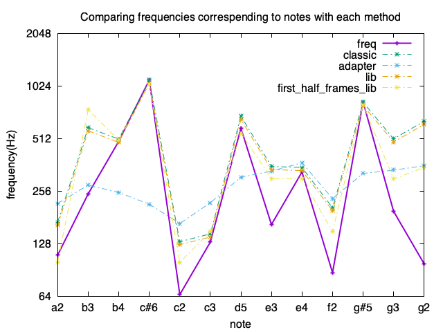

# guitar_bend_trainer
My bends sucks, I want to work on that.

To work on the project, I need to understand some concepts about the sound processing field. 

# Pitch Detection 
## ZCR
first experiment would be detecting multiple musical notes using ZCR and comparing the classical methodology and the proposed methodology form musical notes in [1]. I also added the librosa library zcr which calculates the zcr for each frame and taking in consideration a hop_size too, I calculated the average of zcr on the frames of the audios, and also the average of just taking the first 10 frames( as i noticed the audio is loud at first that it get's less loud, so I was curious if calculting the avg of the entire audio will affect the calculation and give a bigger error )   

It looks like the adapter is the most accurate method out of the 4 . 

but just calculating the diff between the real frequency of the pitch and the frequency calculated by the method is not enough to determine which method is better. 
As Human perception of pitch is logarithmic (base 2) rather than linear, the error depends also on the frequency value. 
Instead of re-calculating the error taking in consideration the real frequency of a pitch, I opted for plotting the pitch freqency and the frequencies calculated by different method, and present them on a $log_2$ scale. We can notice that the 'adapted' method from the paper is always the most accurate.  

 But still the results are not promessing. So using ZCR is not really viable for me. 

## Directions and Questions 

- Do i need to detect the harmonics? Do they have a role in affecting the feeling of a bend ? 
- variying the sampling rate, depending on the instrument ( each instrument has a max frequency that can generate ), or can we have less
consuming method to define roughly the freq range of the wavesound so we can decrease the sampling rate for more speed and more 'accuracy' ? 
- Test if low frequency can be detected with better frequency.

# References
[1] R. G. Amado and J. V. Filho, "Pitch detection algorithms based on zero-cross rate and autocorrelation function for musical notes," 2008 International Conference on Audio, Language and Image Processing, Shanghai, China, 2008, pp. 449-454, doi: 10.1109/ICALIP.2008.4590188. 

